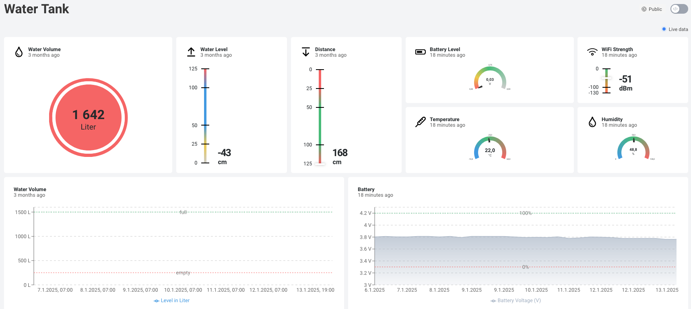

# Water Tank Level Sensor

[](https://opensource.org/licenses/MIT)
[](https://esphome.io/)
[](https://github.com/username/water-tank)

A smart water level monitoring system for underground rainwater tanks using ESPHome on an ESP32-C6 microcontroller. This project measures water level using an ultrasonic distance sensor, temperature, and humidity, and sends the data to a cloud dashboard.

## Table of Contents
- [Quick Start](#quick-start)
- [Overview](#overview)
- [Requirements](#requirements)
  - [Hardware](#hardware)
  - [Software](#software)
- [Installation](#installation)
- [Usage](#usage)
- [Wiring](#wiring)
- [Project Structure](#project-structure)
- [Dashboard](#dashboard)
- [Troubleshooting](#troubleshooting)
- [Power Considerations](#power-considerations)
- [Contributing](#contributing)
- [Resources](#resources)
- [Contact](#contact)
- [License](#license)

## Quick Start
```bash
# Clone the repository
git clone https://github.com/username/water-tank.git
cd water-tank

# Configure your settings
cp common/secrets-template.yaml common/secrets.yaml
# Edit secrets.yaml with your WiFi credentials

# Install dependencies
pip install esphome

# Validate and flash
esphome config water-tank.yaml
esphome run water-tank.yaml
esphome logs water-tank.yaml

or 

esphome compile water-tank.yaml 
esphome upload water-tank.yaml 
```

## Overview

This system monitors:
- Water level and volume in an underground rainwater tank (e.g. Graf Regenwassertank/Zisterne)
- Temperature and humidity
- Battery voltage
- WiFi signal strength

  
*ESP32-C6 board with sensors and DataCake dashboard visualization*

## Requirements

### Hardware 

- ESP32 programmable chip: [Seeed XIAO ESP32-C6 8MB](https://www.seeedstudio.com/Seeed-Studio-XIAO-ESP32C6-p-5884.html) (~$6)
- Ultrasonic distance sensor: JSN-RS04t or [AJ-SR04M](https://www.amazon.com/dp/B07S1KPYVT) (~$10) (Note: AJ-SR04M only works with JSN-SR04T mode)
- Temperature & humidity sensor: [AM2302/DHT22](https://www.adafruit.com/product/393) (~$10)
- Battery: 3.7V LiPo battery with JST connector (optional for portable use)
- Breadboard and jumper wires for prototyping

### Software 

- Python 3.7 or higher
- [PlatformIO](https://platformio.org/) - Development environment
- [Espressif ESP-IDF](https://www.espressif.com/en/products/socs/esp32) - ESP32 framework
- [ESPHome](https://esphome.io/) - Firmware creation tool

## Installation

1. Clone this repository
2. Copy `/common/secrets-template.yaml` to `/common/secrets.yaml` and configure your WiFi credentials
3. Install ESPHome and dependencies:
   ```bash
   pip install esphome
   ```
4. Validate the configuration:
   ```bash  
   esphome config water-tank.yaml
   ```
5. Connect your ESP32-C6 to your computer via USB
6. Flash the firmware:
   ```bash
   esphome run water-tank.yaml
   ```
7. Compile and upload the firmware:
   ```bash
   esphome compile water-tank.yaml
   esphome upload water-tank.yaml
   ```
8. View logs:
   ```bash
   esphome logs water-tank.yaml
   ```
## Webinterface

http://<device_ip>:80

## Webinterface

Access the web interface at:
```
http://<device_ip>:80
```

## Usage

Once installed, the device will:
1. Wake up at configured intervals to take measurements
2. Send data to your configured dashboard (DataCake)
3. Go back to deep sleep to conserve battery power

You can adjust the measurement frequency and other parameters in the `water-tank.yaml` configuration file:

```yaml
# Example configuration changes
deep_sleep:
  run_duration: 30s
  sleep_duration: 60min  # Change to adjust measurement frequency
```

## Wiring

  
*Breadboard wiring of the water tank level sensor setup*

### Pin Configuration

The following pins are used in this project:
```yaml
  pin_battery_voltage: GPIO0  # GPIO0 D0
  pin_wakeup:          GPIO1  # GPIO1 left/bottom (only pins 0, 1, 2, 3, 4, 5, 6, 7 may support wakeup)
  pin_dht:             GPIO2  # GPIO2 D2
  pin_ultrasonic_tx:   GPIO18 # GPIO18 Tx/Echo
  pin_ultrasonic_rx:   GPIO20 # GPIO20 Rx/Trig
```

## Enclosure

  
*Enclosure of the water tank level sensor setup*

## Project Structure

```
water-tank/
├── common/
│   ├── secrets-template.yaml  # Template for WiFi and API credentials
│   ├── secrets.yaml           # Your actual credentials (gitignored)
│   ├── esp32c6.yaml           # ESP32-C6 specific configuration
│   └── base.yaml              # Base ESPHome configuration
├── images/                    # Project images and diagrams
├── water-tank.yaml            # Main ESPHome configuration
├── README.md                  # This documentation
└── LICENSE                    # MIT License
```

## Dashboard

The dashboard was realized using [DataCake](https://datacake.co/) which displays the current and past water level, battery level and the temperature and humidity.

  
*DataCake Dashboard showing water level, temperature, and battery status*

### Setting Up Your Own Dashboard

1. Create a free account on [DataCake](https://datacake.co/)
2. Create a new device type "Water Tank Monitor"
3. Add the following fields:
   - Water Level (%)
   - Water Volume (L)
   - Temperature (°C)
   - Humidity (%)
   - Battery Voltage (V)
   - Battery Level (%)
   - WiFi Signal (dBm)
4. Update your configuration with the DataCake API endpoint (a sample endpoint is already included in the configuration)

## Troubleshooting

### Common Issues and Solutions

| Problem | Possible Cause | Solution |
|---------|---------------|----------|
| **Inaccurate readings** | Sensor obstruction or misalignment | Ensure the ultrasonic sensor is properly positioned and not obstructed |
| **Battery drains quickly** | Insufficient deep sleep | Check the deep sleep configuration in your YAML file, increase `sleep_duration` |
| **Connection issues** | Poor WiFi signal | Verify WiFi credentials and signal strength at the installation location |
| **No data on dashboard** | API configuration issue | Check your DataCake API key and endpoint in `secrets.yaml` |
| **Sensor not detected** | Wiring issue | Double-check pin connections according to the wiring diagram |
| **ESPHome build fails** | Missing dependencies | Run `pip install -r requirements.txt` to install all dependencies |

### Debug Mode

To enable debug logging:

```yaml
# In water-tank.yaml
logger:
  level: DEBUG
```

## Power Considerations

- **Battery Life**: With default settings (60-minute intervals), expect approximately 3-4 months of battery life using a 2000mAh LiPo battery.
- **Solar Option**: For extended operation, consider adding a small solar panel (5V/1W) with a charging circuit.
- **Power Consumption**:
  - Active mode: ~80mA
  - Deep sleep: ~0.1mA
  - Measurement cycle: ~5 seconds
- **Battery Voltage Range**:
  - Full charge: 4.2V
  - Minimum operating voltage: 3.3V

## Contributing

Contributions are welcome! Here's how you can help:

1. Fork the repository
2. Create a feature branch: `git checkout -b feature/amazing-feature`
3. Commit your changes: `git commit -m 'Add some amazing feature'`
4. Push to the branch: `git push origin feature/amazing-feature`
5. Open a Pull Request

Please make sure to update tests and documentation as appropriate.

## Resources

- [Getting Started with Seeed Studio XIAO ESP32C6](https://wiki.seeedstudio.com/xiao_esp32c6_getting_started/)
- [ESPHome Documentation](https://esphome.io/)
- [DataCake Documentation](https://docs.datacake.de/)
- [Ultrasonic Sensor Guide](https://randomnerdtutorials.com/complete-guide-for-ultrasonic-sensor-hc-sr04/)
- [Battery Optimization Techniques](https://randomnerdtutorials.com/power-saving-esp32-arduino-deep-sleep-mode/)

## Contact

- Author: Roland Ortner
- Date: 2025-07-25
- LinkedIn: [https://www.linkedin.com/in/roland-ortner/](https://www.linkedin.com/in/roland-ortner/)
- Reports: battery voltage, WiFi signal, level and volume in water tank
- Icons: [https://pictogrammers.com/library/mdi/](https://pictogrammers.com/library/mdi/)

## License

This project is open source and available under the [MIT License](LICENSE).

